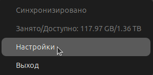
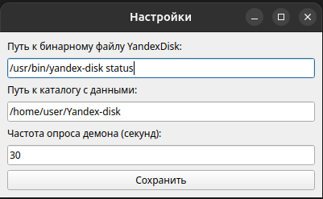

[In English](README_en.md)
# Yandex Disk indicator

Приложение-индикатор для системного трея ubuntu отображающее статус синхронизации Yandex Disk: https://yandex.ru/support/yandex-360/customers/disk/desktop/linux/ru/

Оригинал этого репозитория: [gitlab.uscr.ru/yadiskindicator](https://gitlab.uscr.ru/public-projects/yadiskindicator)

## Оглавление
- [Связаться с автором](#контакты)
- [Сборка](#сборка)
- [Запуск](#запуск)
- [Настройка и просмотр статуса синхронизации](#настройка-и-просмотр-статуса-синхронизации)
    - [Иконки индикатора](#иконки-индикатора)
- [Принцип работы](#принцип-работы)

# Контакты

Telegram [UsCr0](https://t.me/UsCr0)

# Сборка

    python3 -m venv venv
    source venv/bin/activate
    pip install -r requirements.txt
    # Собираем "бинарник"
    # Готовый файл будет лежать в dist/indicator
    pyinstaller --onefile \
        --add-data "error.png:error.png" \
        --add-data "notavail.png:notavail.png" \
        --add-data "ok.png:ok.png" \
        --add-data "sync.png:sync.png" \
        indicator.py \
        --workpath .
    sudo cp dist/indicator /usr/local/bin/YaDiskIndicator

# Запуск

    /usr/local/bin/YaDiskIndicator

# Настройка и просмотр статуса синхронизации

При нажатии правой кнопкой на иконку в трее отображается расширенная информация. Для настроек индикатора нужно войти в "Настройки". 

Доступно 3 параметра для настройки:

- Путь к бинарному файлу Yandex-disk (по умолчанию /usr/bin/yandex-disk status)
    - Команда для отображения статуса синхронизации
- Путь к каталогу с данными (по умолчанию ~/Yandex-disk)
    - Каталог с синхронизированными файлами
- Частота опроса демона (секунд) (по умолчанию 30)
    - Частота в секундах, с которой будет опрашиваться статус демона

Настройки сохраняются в ~/.config/yadiskindicator.yaml

## Иконки индикатора

Файлы синхронизированы: 

Синхронизация или индексация: 

Зарезервировано (пока не используется): 

Иконка по умолчанию. Отображается в любой непонятной ситуации: 

# Принцип работы

Через заданный в настройках интервал вызывается команда для получения статуса диска. Текстовый вывод парсится, в зависимости от статуса меняется иконка индикатора.