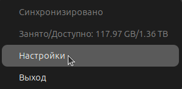
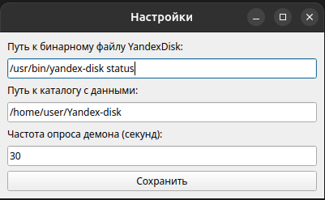

> **Note**: This document is an automatic translation from Russian using ChatGPT. 

[На русском](README.md)

# Yandex Disk Indicator

- [Contacts](#contacts)
- [Building](#building)
- [Launching](#launching)
- [Configuration and Status Monitoring](#configuration-and-status-monitoring)
    - [Indicator Icons](#indicator-icons)
- [How It Works](#how-it-works)

# Description

A system tray indicator application for Ubuntu showing the synchronization status of Yandex Disk: https://yandex.ru/support/yandex-360/customers/disk/desktop/linux/en/

Original repository: [gitlab.uscr.ru/yadiskindicator](https://gitlab.uscr.ru/public-projects/yadiskindicator)

# Contacts

Telegram [UsCr0](https://t.me/UsCr0)

# Building

    python3 -m venv venv
    source venv/bin/activate
    pip install -r requirements.txt
    # Build the binary
    # The final file will be located in dist/indicator
    pyinstaller --onefile \
        --add-data "error.png:error.png" \
        --add-data "notavail.png:notavail.png" \
        --add-data "ok.png:ok.png" \
        --add-data "sync.png:sync.png" \
        indicator.py \
        --workpath .
    sudo cp dist/indicator /usr/local/bin/YaDiskIndicator

# Launching

    /usr/local/bin/YaDiskIndicator

# Configuration and Status Monitoring

Right-clicking on the tray icon displays extended information. To configure the indicator, go to "Settings."

Three parameters are available for configuration:

- Path to the Yandex-disk binary (default: /usr/bin/yandex-disk status)
    - Command to display the synchronization status
- Path to the data directory (default: ~/Yandex-disk)
    - Directory containing synchronized files
- Daemon polling frequency (seconds) (default: 30)
    - Frequency in seconds to query the daemon status

Settings are saved in ~/.config/yadiskindicator.yaml

## Indicator Icons

Files synchronized: 

Synchronization in progress: 

Shown during file indexing: 

Default icon. Shown in case of any unexpected situation: 

# How It Works

At the specified interval, a command is executed to get the disk status. The text output is parsed, and the indicator icon changes according to the status.